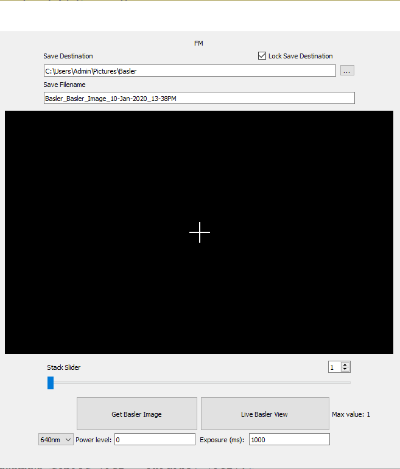
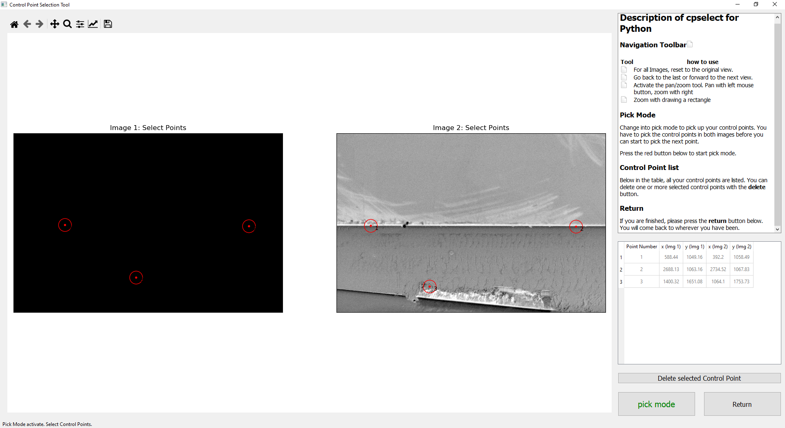

# Getting started  with `piescope_gui`

## Turn on hardware in the lab

Make sure:
1. the lasers are switched on,
2. the fluorescence detector is switched on,
3. the SMARACT objective lens stage is switched on and connected,
4. you have loaded your sample into the FIBSEM

Make sure you remember to turn off all of these things at the end of your session!

## Opening the GUI

The `piescope_gui` has been installed on the PFIB2 support machine.

1. Open the "*Anaconda Prompt*" from the start menu of the PFIB2 computer.
2. At the command prompt type:
```
conda activate piescope-dev
piescope
```

You should then see `piescope_gui` launch on the screen.


## Shutdown procedure

Before leaving please remember to properly close the hardware and software.

Make sure each of these steps is completed:
- Close the piescope GUI
- Put the FIBSEM to sleep (click the "Sleep" button on the Xt UI)
- Turn off lasers (turn the key on the laser box)
- Log out of the microscope support computer.

## Troubleshooting
If you run into problems, there are two places you can look to find information to help:

1. The content of any error messages that might pop up on screen.
2. The terminal output in the Anaconda Prompt you used to launch `piescope`.
*(You can copy-paste this by opeining the main menu (click the icon at the top left corner of the Anaconda Prompt window) then Edit > Select All and Edit > Copy.)*

This information, along with a detailed description of what happened, will help your friendly developer figure out what might have happened.

Additionally, try this checklist of possible issues:

**Python environment**

Check that you have the correct python envireonment activated in Anaconda.
You can see this by looking at the name in brackets to the left of each line
in the terminal you used to launch the piescope GUI from, eg:
```
(piescope) ~/Users/Admin>
```
If you don't see `(piescope)` at the start of each line at the prompt:
* Try `conda activate piescope`
(if there's an error, follow the installation instructions again).
* Try `pip list`
If you don't see `piescope` and `piescope_gui` in the list of packages,
or if see the wrong version number, try the installation instructions again.

**Lasers**
* Make sure the lasers are turned on (turn the key on the laser box)
* Make sure the Toptica software is not open, all lasers must be disconnected.

**Fluorescence detector (Basler)**
* Make sure the detector is plugged in and turned on.
* Make sure that Pylon software suite is not open at the same time.
* Make sure the IP address and network configuration for the detector is ok:
The Network Configuration under the "Connection" tab should be
169.254.111.111, port 139.

Checking the network connection of the Basler fluorescence detector:
* Click the "Connect" button under the """" Tab.
* If connection successful, type "GSI" into the textbox & press "Send Command".
If the Basler is properly connected you will see output ":ID4050785033",
but if not connected the output will be a diamond with a question mark.

Checking IP address used to connect to the Basler fluorescence detector:
1. Go to the Start Menu
2. Type "View Network Connectons"
3. Press enter.
4. Right click on "Ethernet 2" and press "Properties".
5. Under the "This connection uses the following items" line, navigate to "Internet Protocol Version 4 (TCP/IPv4)
6. Click properties.
7. Click "Use the following IP address:" if it is not already selected.
8. Check/change the values:
  ```
  IP address: 169.254.111.112
  Subnet Mask: 255.255.255.192
  Default Gateway: Blank
  ```
9. Press OK.

## Suggested end-to-end workflow
This is the suggested end-to-end workflow for experiments, consisting of six steps:


# Standard GUI operations

[**Imaging**](#imaging)
- [FIBSEM imaging](FIBSEM-imaging)
- [Fluorescence imaging](#fluorescence-imaging)

[**Stage movement**](#stage-movement)
- [Sample stage](#sample-stage)
- [Objective stage](#objective-stage)

[**Additional functions**](#additional-functions)
- [Fluorescence volume acquisition](#fluorescence-volume-acquisition)
- [Image correlation](#image-correlation)
- [Milling](#milling)

## Overview


There are three main regions of the GUI:

1. Left hand sidebar (includes red, blue, green, and orange outlines): Control panel
2. Center left (purple outline): Flourescence image acquisition and display
3. Right side (light blue outline): FIBSEM image acquisition and display

### Left hand sidebar controls

The left hand sidebar controls are grouped according by function:
* Red outline: Fluorescence volume imaging
* Blue outline: Image correlation and milling pattern creation
* Green outline: Sample stage movement between FIBSEM and fluorescence imaging positions
* Orange outline: Objective lens stage movement for focussing fluorescence images

## Imaging

### FIBSEM imaging


#### Taking FIBSEM images

*Note:* Check the settings before taking images.

To take a new electron image press the "Get SEM Image" button.

To grab the last taken electron image press the "Grab Last SEM" button.

#### Settings for FIBSEM imaging

File saving settings are changed in the top section of the
Scanning Electron Microscope section (FIBSEM):

To change the folder in which the electron microscope images are saved,
uncheck the "Lock Save Destination" checkbox and either:
* manually type in the path to the folder for saving, or
* press the [ ... ] button and navigate to the folder for saving.

Imaging parameters like "dwell time" and "resolution" can be changed
at the bottom right of the FIBSEM GUI controls.
For any other imaging parameters (not displayed on the piescope GUI),
`piescope` will apply whatever the current imaging settings are in Xt.
* Dwell time is set in microseconds (must be an integer value)
* Image resolution can be selected from the drop down list of options.
* Check the autocontrast box to run the autocontrast routine before new image
acquistions.

### Fluorescence imaging



#### Taking fluorescence images

*Note:* Check the settings before taking images.

To take a single fluorescence image click the "Get Basler Image" button.

To start live imaging click the "Live Basler View" button.
To stop live imaging click the button again.

*You **must stop** live imaging before taking more fluorescence images
(for both single flouorescence images, or fluorescence image volumes).*

#### Settings for fluorescence imaging

File saving settings are changed in the top section of the
Fluorescence Microscope section (FIBSEM):

To change the folder in which the electron microscope images are saved,
uncheck the "Lock Save Destination" checkbox and either:
* manually type in the path to the folder for saving, or
* press the [ ... ] button and navigate to the folder for saving.

Fluorescence Imaging parameters are changed in the bottom section [Orange].

First move the objective lens into position using the 'Absolute' or 'Relative'
stage controls.

Then choose the laser wavelength from the drop down menu on the left.
Available options are 640nm, 561nm, 488nm, and 405nm (excitation wavelengths).

Then enter the desired power level as a percentage (integer with range 0-100).


**Correlation**

Then, under the correlation button <!--[show image]-->,  select the path to which the output correlated image will be saved to.  This can be done by manually entering the path in the text field or by clicking on the [ ... ] button and navigating to the desired path.

Once the preparation is complete click the "Correlation" button <!--(IMAGE)--> which will open the [Control Point Selection Tool](#image-correlation).

<!--Show Image-->

This window places the two images to correlate side by side.  There are controls to interact with the images, such as zooming and panning, in the top left corner.

A help dialogue is located in the top right corner to guide you through the point selection process.

Correlation is done by clicking on control points in each image that correspond to the same location.

Once correlation is complete and the "Return" button is clicked, the [Milling Parameter Selection](#milling) window will be opened.


## Milling

<!--Image of window-->

The Milling Parameter Window shows the overlaid image of the correlation of two images completed in the [Control Point Selection Tool](#image-correlation).

**Creation of milling pattern**

To create a rectangular milling pattern simply click and drag from the top left corner of the desired rectangle to the bottom left corner.

Once satisfied with the rectangle press the "Send milling pattern to FIBSEM" button to send the pattern to the FIBSEM controller.

**Milling control**

Milling of the rectangular pattern sent to the FIBSEM can be controlled by starting, pausing and stopping.

To start milling with the pattern sent to the FIBSEM, press the "Start milling pattern" button.

To pause the milling operation in progress, press the "Pause milling pattern" button.

To completely stop the milling process, press the "Stop milling pattern" button.

When done with milling, press the "Exit" button to return to the GUI main window.


## TROUBLESHOOTING

### Troubleshoting opening the GUI

If you are having trouble with opening the GUI, check that you have the
correct envireonment activated in Anaconda.
You can check this by looking at the name in brackets to the left of each line
in the terminal you used to launch the piescope GUI from, eg:
```
(piescope) ~/Users/Admin>
```

If an error is thrown whilst operating the GUI, check that each piece of hardware is properly connected as per [Hardware connections](#hardware-connections).


**Lasers**

An issue that can be encountered when communicating with the laser control hardware is that another program is currently controlling the lasers.  The most common cause of this is that Toptica is connected to the lasers.  This can be checked by opening the Toptica application by going to the start menu, typing "Topas" and pressing enter.  If the application is connected to the lasers, as shown in the image below, click "disconnect" under MENU. <!--(IMAGES).-->


### Objective stage
Buttons and reading
You should now be able to connect to the lasers properly.

**Basler**

If communicaton to the Basler fails it is possibly an IP address problem.

This can be checked by opening the ASCII Terminal by going to the start menu and typing "ASCII" and pressing enter.

### Correlation




### Milling


